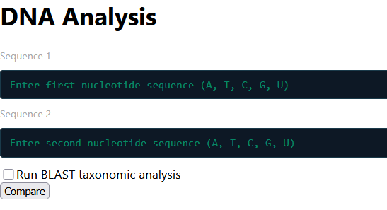
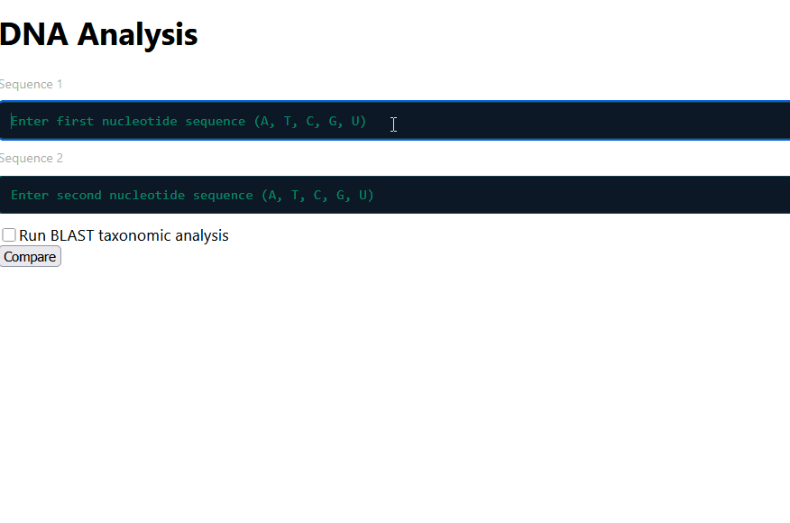

# 🧬 DNA Sequence Alignment & Taxonomy Pipeline

A full-stack bioinformatics web application that performs local DNA sequence alignment using the **Smith-Waterman algorithm** and optionally identifies organisms via **NCBI BLAST** taxonomic analysis.

> Built by a biology graduate combining domain expertise with full-stack software engineering — from algorithm implementation to interactive UI.

## 📸 Screenshots

### 1. Sequence Input Form



---

### 2. Scoring Matrix with Traceback Animation


---

### 3. Alignment Result & Similarity Score



---

### 4. BLAST Taxonomic Result


---

## ✨ Features

- **Local Sequence Alignment** — Custom Smith-Waterman dynamic programming implementation
- **Interactive Scoring Matrix** — Color-coded visualization with animated traceback path
- **Similarity Scoring** — Percentage similarity calculated from aligned sequences
- **BLAST Taxonomic Analysis** — Optional NCBI BLAST integration to identify organism from sequence
- **RNA → DNA Conversion** — Automatic conversion of RNA input sequences
- **Input Validation** — Nucleotide-only enforcement (A, T, C, G, U)
- **Async Architecture** — Matrix renders immediately; BLAST runs in the background
- **Responsive Error Handling** — Descriptive errors for invalid input or failed requests

---

## 🧪 Sample Sequences for Testing

**Identical sequences (100% similarity):**
```
Sequence 1: ATCGTACGATCGTACG
Sequence 2: ATCGTACGATCGTACG
```

**Partial match (interesting alignment):**
```
Sequence 1: ATGGAGAGCCTTGTCCCTGGTTTCAACGAGAAAACACACGTCCACTCAAA
Sequence 2: AGAGTTTGATCCTGGCTCAGATTGAACGCTGGCGGCAGGCCTAACACATG
```

**BLAST test sequence (E. coli 16S rRNA — returns organism ID):**
```
AGAGTTTGATCCTGGCTCAGATTGAACGCTGGCGGCAGGCCTAACACATGCAAGTCGAACGGTAACAGGA
```

---

## 🏗️ Architecture

```
User Input (React UI)
        ↓
  POST /compare  →  Flask Backend
                        ├── Validate nucleotide sequences
                        ├── Convert RNA → DNA if needed
                        ├── Run Smith-Waterman alignment
                        └── Return matrix + aligned sequences
        ↓
  Matrix renders immediately in browser
        ↓
  POST /blast (async, background)  →  Flask Backend
                                           ├── Submit to NCBI BLAST
                                           └── Parse taxonomic result
        ↓
  BLAST result fills in when ready
```

---

## 🛠️ Tech Stack

**Frontend**
- React (functional components + hooks)
- JavaScript (async/await, Fetch API)
- Component-based architecture

**Backend**
- Python / Flask
- BioPython (NCBI BLAST integration)
- Flask-CORS

**Algorithm**
- Custom Smith-Waterman local alignment (dynamic programming)
- Scoring: Match +1, Mismatch -1, Gap -1

---

## 🚀 Running Locally

### Prerequisites
- Python 3.8+
- Node.js 16+
- pip + npm
- An active internet conneciton (required for NCBI BLAST queries)

### Python dependencies
pip install flask flask-cors biopython

### Node dependencies
npm install

### Optional but recommended
- A Python virtual environment to avoid package conflicts:
```bash
  python -m venv env
  source env/bin/activate       # Mac/Linux
  env\Scripts\activate          # Windows
  pip install flask flask-cors biopython

### Backend setup

```bash
cd backend
pip install flask flask-cors biopython
python app.py
```
Flask runs at `http://localhost:5000`

### Frontend setup

```bash
cd frontend
npm install
npm start
```
React runs at `http://localhost:3000`

---

## 📁 Project Structure

```
DNA-Alignment-Pipeline/
├── backend/
│   ├── app.py                    # Flask API — /compare and /blast routes
│   └── Smith_Waterman_Revised.py # Smith-Waterman algorithm + utilities
├── src/
│   ├── App.js                    # Main React component
│   └── services/
│       └── apiService.js         # Fetch API calls with timeout handling
└── README.md
```

---

## 🔬 Algorithm Overview

The **Smith-Waterman algorithm** finds the optimal *local* alignment between two sequences — meaning it identifies the most similar region, even if the full sequences differ significantly. This makes it ideal for identifying conserved regions in DNA.

**How it works:**
1. Build a scoring matrix where each cell represents the best alignment score up to that position
2. Fill the matrix using: `score = max(0, diagonal + match/mismatch, up + gap, left + gap)`
3. Traceback from the highest-scoring cell to reconstruct the aligned sequences

This is the same family of algorithms used in tools like BLAST itself.

---

## 💡 Why I Built This

My academic background is in biology, with senior thesis and research experience heavily focused on viruses. This project bridges bioinformatics and software engineering by combining:

- **Algorithmic implementation** — dynamic programming from scratch
- **Backend API design** — RESTful Flask with proper error handling
- **Frontend visualization** — animated matrix with React state management
- **External data integration** — live NCBI BLAST queries

It demonstrates the ability to build complete systems — from algorithm to UI — grounded in real scientific context.